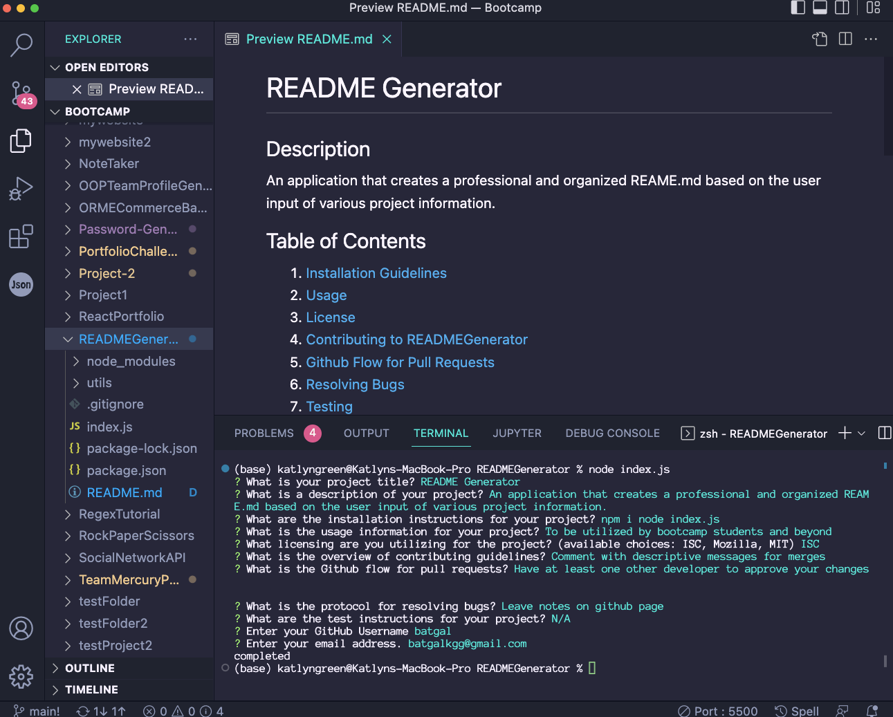

# READMEGenerator

## Description

An application that creates a professional and organized REAME.md based on the user input of various project information.

## Table of Contents

- [READMEGenerator](#readmegenerator)
  - [Description](#description)
  - [Table of Contents](#table-of-contents)
    - [Installation Guidelines ](#installation-guidelines-)
    - [Description](#description-1)
    - [Usage ](#usage-)
    - [License ](#license-)
    - [Contributing to READMEGenerator ](#contributing-to-readmegenerator-)
    - [Github Flow for Pull Requests ](#github-flow-for-pull-requests-)
    - [Resolving Bugs ](#resolving-bugs-)
    - [Testing ](#testing-)
    - [Questions ](#questions-)

### Installation Guidelines 

npm i node index.js

### Description

An application that creates a professional and organized REAME.md based on the user input of various project information.

### Usage 

To be utilized by bootcamp students and beyond

### License 

ISC

### Contributing to READMEGenerator 

Comment with descriptive messages for merges

### Github Flow for Pull Requests 

Have at least one other developer to approve your changes

### Resolving Bugs 

Leave notes on github page

### Testing 

N/A

### Questions 

Github Username: batgal
Email: batgalkgg@gmail.com
